# Architecture

## System intent and boundary

The system provides a reproducible workflow for fake-news **classification** with explicit data, model, serving, and operational boundaries. It does not crawl the web or independently determine the truth of a claim. Dataset labels and fact-check ratings are transformed into a documented binary classification contract, and model output remains unsuitable as the sole basis for high-impact decisions.

```mermaid
flowchart LR
    A[Governed raw inputs\nISOT / WELFake / ClaimReview] --> B[Data adapters and provenance]
    B --> C[Fixed train / validation / test partitions]
    C --> D[Train-only text and tabular transforms]
    D --> E[Classical, BiLSTM, BERT, and unsupervised paths]
    E --> F[Evaluation, calibration, and MLflow artifacts]
    F --> G[Verified native package\noptional ONNX export]
    G --> H[FastAPI service]
    H --> I[Metrics, structured logs, rate limiting, drift jobs]
    I --> J[Human-reviewed retraining signal]
```



The architecture enforces split-before-fit. Vocabulary learning, imputation, encoding, scaling, dimensionality reduction, clustering, anomaly detection, calibration, thresholding, and model fitting are constrained to their permitted training data. The final test partition is excluded from modelling decisions [SRC-003].

## Components

| Layer | Primary implementation | Contract |
|---|---|---|
| Configuration | `configs/`, `params.yaml`, `src/config.py` | Centralizes data, model, evaluation, tracking, and serving settings |
| Data | `src/data/ingestion.py`, `src/data/claimreview.py`, `dvc.yaml` | Canonical records, provenance, validation, deduplication, and fixed partitions |
| Features | `src/features/` | Train-fitted text, embedding, preprocessing, and unsupervised transformations |
| Models | `src/models/` | Classical baselines; optional BiLSTM and BERT paths; clustering and anomaly utilities |
| Evaluation | `src/evaluation/`, `src/evaluate.py` | Metrics, calibration, comparisons, plots, and held-out reporting |
| Tracking and reports | `src/tracking.py`, MLflow, `scripts/generate_reports.py` | Optional experiment tracking and provenance-aware report generation |
| Artifact boundary | `src/serving/export.py`, `src/serving/predictor.py` | Package manifest, integrity checks, native inference, and optional ONNX parity |
| API and monitoring | `src/serving/`, `src/monitoring/` | Health/readiness, prediction, Prometheus metrics, drift jobs, logging, and rate limiting |
| Deployment | `Dockerfile`, `docker-compose.yml`, `k8s/base/` | Rootless runtime image, local orchestration, workload manifests, network isolation, and observability hooks |
| Assurance | `.github/workflows/ci.yml`, `tests/`, `scripts/source_audit.py` | Source traceability, linting, typing, SAST, dependency audit, DVC/Kubernetes validation, coverage, and container scanning |

## Data and reproducibility flow

`dvc.yaml` defines `claimreview_current`, `ingest`, `train`, and `evaluate` stages. The ClaimReview collector uses structured ClaimReview input rather than publisher article scraping, records collection provenance, and performs chronological partitioning. Legacy dataset adapters normalize supported input schemas into the same internal label convention. Raw data, artifacts, reports, and MLflow stores are not treated as Git source code; their provenance and access terms are recorded in the source register.

The master lifecycle script initializes local tracking, invokes DVC reproduction, evaluates an artifact, exports ONNX only when applicable parity verification succeeds, runs tests, and generates a report bundle. It fails on unavailable governed inputs rather than manufacturing an output.

## Serving and monitoring flow

FastAPI exposes health, readiness, metrics, single prediction, batch prediction, and drift-monitoring routes. Startup validates the runtime artifact and performs a warm-up before readiness is reported. Request handling applies validation, payload and batch bounds, a concurrency budget, structured request-ID logging, rate limiting, and safe error handling before inference. Drift processing is asynchronous and bounded; it is a signal for human review, not an automated retraining trigger.

The native packaged model is authoritative for sparse feature workflows. ONNX export is only available through dense-compatible paths and is guarded by parity checks. Redis is used for distributed rate-limiting when configured; circuit-breaker degradation is fail-open to protect inference availability during a Redis outage, with a critical log signal.

## Deployment and trust boundaries

The production image is multi-stage and runs as non-root `appuser`. Docker Compose models the API, Redis, MLflow, and synthetic traffic services with bounded resource and filesystem controls. Kubernetes assets add Deployment, HPA, NetworkPolicy, ingress, and ServiceMonitor declarations; their schemas are checked in CI. Production operators must supply environment-specific secrets, TLS provisioning, model artifacts, external storage, and monitoring configuration.

GitHub Actions validates source registration, configuration, DVC stages, Kubernetes manifests, linting, strict typing, Bandit, dependency advisories, compilation, MLflow smoke operation, tests with a 95% source-coverage threshold, non-root image identity, and actionable critical image CVEs. High-severity image findings are reported but do not block the build under the current policy.

## Directory guide

```text
configs/                 Versioned runtime, model, evaluation, and dataset configuration
data/                    Ignored raw/processed data working area
docs/                    Cards, compliance evidence, deployment/security documentation, ADRs, sources
k8s/base/                Kubernetes namespace, workload, network, ingress, and monitoring manifests
notebooks/               Exploratory and course-evidence notebooks
reports/                 Ignored/generated evaluation outputs and manifests
scripts/                 Lifecycle, export, reporting, audit, and synthetic traffic entry points
src/data/                Ingestion and ClaimReview collection
src/features/            Leakage-safe transformations and embeddings
src/models/              Classical, neural, and unsupervised model implementations
src/evaluation/          Metrics, plots, and search utilities
src/serving/             API, predictors, export, and rate limiting
src/monitoring/          Drift statistics and job management
tests/                   Unit, integration, security, resilience, and container-boundary tests
```

## References

The governing syllabus and module-to-file evidence is [`docs/compliance_matrix.md`](docs/compliance_matrix.md) [SRC-003]. Dataset provenance is recorded in [`docs/sources.md`](docs/sources.md) [SRC-001] [SRC-002] [SRC-045]; deployment sources are registered under [SRC-030]–[SRC-044].
