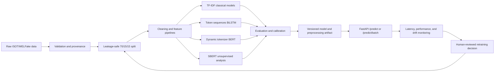

# Fake News Detection Using NLP, BiLSTM, and BERT

A modular, reproducible, production-style fake-news classification system aligned with the **Machine Learning (25SC2107E)** syllabus and its Course Outcomes **CO1–CO6**. The implementation is designed for the ISOT Fake News Dataset and WELFake dataset, with a common ingestion contract, leakage-safe preprocessing, classical baselines, unsupervised structure discovery, optional BiLSTM and BERT fine-tuning, rigorous evaluation and calibration, FastAPI serving, artifact packaging, and drift monitoring.

> **Important limitation:** This project classifies patterns associated with dataset labels. It is not an independent fact-checking system and must not be used as the sole basis for editorial, legal, medical, financial, or public-safety decisions.

## Compliance status

The repository is being implemented against the attached `MachineLearninghandout.pdf`. Every module, script, notebook, experiment, and operational artifact will be mapped to a course outcome and syllabus module in [`docs/compliance_matrix.md`](docs/compliance_matrix.md). Inline comments in the required implementation modules identify the relevant syllabus coverage; the source register provides the academic and technical references behind those comments.

| Handout area | Repository evidence |
|---|---|
| **CO1 / M1**: ML lifecycle | `src/data/`, `src/features/`, `src/models/`, `src/evaluation/`, `src/serving/`, `src/monitoring/`, lifecycle diagram, request trace, and training-serving boundary documentation |
| **CO2 / M2**: linear models | L1, L2, and ElasticNet Logistic Regression over TF-IDF; scaling rationale; coefficient and regularization analysis |
| **CO3 / M3**: tree models | Pruned Decision Tree, OOB Random Forest, XGBoost, LightGBM, Gini/permutation/SHAP importance |
| **CO4 / M4**: unsupervised learning | K-Means, elbow/silhouette, hierarchical clustering, DBSCAN, PCA, t-SNE, UMAP, Isolation Forest, feature augmentation |
| **CO5 / M5**: evaluation and selection | 70/15/15 split, stratified 5-fold CV, grid/random/Bayesian-search path, metrics, learning/validation curves, calibration, Brier score, McNemar test |
| **CO6 / M6**: ML engineering | Configuration, versioned artifacts, skew prevention, ONNX/TorchScript where supported, FastAPI, Docker, CI, MLflow, KS/PSI drift monitoring |

## Architecture and lifecycle



A single online request follows the path **HTTP validation → text normalization/tokenization → packaged feature transform → model inference → calibrated response → latency and monitoring hooks**. Batch inference uses the same preprocessing and model artifact over a bounded list of requests. The production boundary is the serialized preprocessing-plus-model artifact, which prevents a serving implementation from silently diverging from training.

## Repository map

| Path | Responsibility | Handout mapping |
|---|---|---|
| `data/` | Raw, processed, external, and reproducibility placeholders; raw data is not committed by default | CO1/M1 |
| `notebooks/` | EDA, unsupervised analysis, model comparison, deep-learning experiments, and evaluation evidence | CO1–CO5 / M1–M5 |
| `src/data/ingestion.py` | ISOT/WELFake adapters, validation, canonical schema, split manifests | CO1/M1 |
| `src/features/` | Cleaning, tokenization, text statistics/readability, TF-IDF, GloVe, Word2Vec, SBERT, imputation, encoding, scaling, and feature contracts | CO1/M1, CO2/M2, CO4/M4 |
| `src/features/preprocessing.py` | Mean/median/KNN/iterative imputation, MissingIndicator, One-Hot/Ordinal/target encoding, StandardScaler, and MinMaxScaler | CO2/M2 |
| `src/features/unsupervised_features.py` | Train-fitted cluster/anomaly feature synthesis with stable schema | CO4/M4 |
| `src/models/unsupervised.py` | K-Means++, Mini-Batch K-Means, hierarchical clustering, DBSCAN, PCA, t-SNE, UMAP, Isolation Forest | CO4/M4 |
| `src/models/classical.py` | Ridge, Lasso, ElasticNet, binary/multinomial Logistic, Decision Tree, Random Forest, histogram XGBoost, leaf-wise LightGBM, permutation and SHAP importance | CO2/M2, CO3/M3 |
| `src/models/lstm.py` | GloVe-initialized BiLSTM classifier | CO1/M1, CO5/M5 |
| `src/models/bert.py` | `bert-base-uncased` fine-tuning path | CO1/M1, CO5/M5 |
| `src/evaluation/metrics.py` | Classification/regression metrics, stratified/nested CV, calibration, McNemar, paired bootstrap, and report schemas | CO5/M5 |
| `src/evaluation/plots.py` | Confusion, ROC/PR, reliability, calibration comparison, learning, and validation curves | CO5/M5 |
| `src/evaluation/search.py` | Grid/random/Bayesian search, result schemas, and serialization | CO5/M5 |
| `src/train.py` and `src/evaluate.py` | Search orchestration, serving-safe packaging, held-out test reporting, calibration, plots, and optional MLflow logging | CO1/M1, CO5/M5, CO6/M6 |
| `src/serving/app.py` | FastAPI `/health`, `/ready`, `/predict`, `/predict/batch`, and `/monitoring/drift` with schema validation and latency headers | CO6/M6 |
| `src/serving/predictor.py` | Bound preprocessing-plus-model inference contract | CO1/M1, CO6/M6 |
| `src/serving/export.py` | Native package manifests, checksums, ONNX/TorchScript export, ONNX Runtime parity | CO6/M6 |
| `src/monitoring/drift.py` | KS/PSI feature and probability drift, text/OOV monitoring, retraining signals | CO6/M6 |
| `src/tracking.py` | Optional MLflow experiment and artifact tracking | CO6/M6 |
| `src/train.py` | Reproducible classical training entry point | CO1/M1, CO2/M2, CO3/M3 |
| `src/evaluate.py` | Held-out artifact evaluation entry point | CO5/M5 |
| `Dockerfile`, `.dockerignore`, `.env.example` | Rootless multi-stage serving image, build exclusions, and runtime configuration | CO6/M6 |
| `docs/deployment.md` | End-to-end request trace, container operation, monitoring, retraining, and security boundary | CO6/M6 |
| `scripts/source_audit.py` | Source-register and URL consistency audit | All outcomes |
| `configs/` | `default.yaml`, `models.yaml`, and `evaluation.yaml` for data, models, evaluation, serving, and monitoring | CO1/M1, CO5/M5, CO6/M6 |
| `tests/` | Unit, integration, leakage, serialization, export, and API tests | CO1–CO6 |
| `docs/sources.md` | Complete source, provenance, license, and source-to-file register | All outcomes |
| `docs/sources.yaml` | Machine-readable source metadata used by audit tooling | All outcomes |
| `docs/compliance_matrix.md` | Script/notebook/test/artifact traceability to every CO and module | All outcomes |
| `docs/dependency_licenses.md` | Dependency and redistribution license inventory | CO6/M6 |
| `.dvc/`, `.dvcignore`, `dvc.yaml`, `params.yaml` | DVC initialization, cache policy, reproducible pipeline stages, and pipeline parameters | CO1/M1, CO6/M6 |
| `scripts/init_mlflow.py` | Idempotent local MLflow experiment initialization | CO1/M1, CO6/M6 |

## Data and label policy

The ingestion layer accepts ISOT and WELFake through adapters rather than assuming one CSV schema. The ISOT source is documented through Ahmed, Traore, and Saad’s publication [1], while the WELFake record is maintained through Zenodo with DOI `10.5281/zenodo.4561253` [2]. WELFake’s Zenodo record describes the released columns and reports the dataset’s published label convention; the repository normalizes all supported inputs to its explicit internal convention of `0 = real` and `1 = fake`, recording any source-label inversion in the ingestion metadata [2].

Raw datasets, pretrained weights, and generated model artifacts are excluded from version control unless their license and repository size make inclusion appropriate. The repository records URLs, DOIs, access dates, versions, checksums, and license terms in [`docs/sources.md`](docs/sources.md). Dataset download and checksum commands will be added to the data-ingestion documentation once the executable pipeline is present.

## Reproducibility and leakage prevention

The default split is stratified **70% training, 15% validation, and 15% test** with a recorded seed and split manifest. Stratified five-fold cross-validation is used for training-set model selection. TF-IDF vocabularies, scalers, token vocabularies, dimensionality reducers, clusterers, anomaly detectors, calibration maps, and thresholds must be fitted only on their permitted training data. The final test set is held out from model-selection and calibration decisions.

Every trained artifact records its configuration, random seed, dataset identity, source checksum where available, software versions, feature schema, model family, and training timestamp. Results are reported only for experiments actually executed; optional models that cannot run because of missing hardware or dependencies are marked as unavailable rather than assigned invented scores.

## Planned commands

The executable workflow is:

```bash
python -m src.data.ingestion --dataset isot --path data/raw/isot --output data/processed
python -m src.train --train data/processed/train.csv --model logistic_l2 --output artifacts/models/logistic_l2.joblib
python -m src.evaluate --test data/processed/test.csv --artifact artifacts/models/logistic_l2.joblib
uvicorn src.serving.app:app --host 0.0.0.0 --port 8000
pytest -q
```

The foundational tranche includes this README, [`docs/sources.md`](docs/sources.md), [`docs/sources.yaml`](docs/sources.yaml), and [`requirements.txt`](requirements.txt). The classical fixture workflow has been exercised; full-dataset and deep-learning benchmark commands must be run only after the corresponding raw data and optional resources are available.

## DVC and MLflow lifecycle infrastructure

DVC is initialized under `.dvc/` and defines the reproducible `ingest`, `train`, and `evaluate` stages in [`dvc.yaml`](dvc.yaml). The ingest stage enforces the strict stratified 70/15/15 split before TF-IDF or any other learned transformation is fit. Configure a user-owned DVC remote without committing credentials, then reproduce the pipeline with:

```bash
python -m pip install -r requirements.txt
dvc remote add -d storage <your-dvc-remote-url>
dvc add data/raw/isot
dvc repro
dvc status
```

MLflow is disabled by default for lightweight runs. Initialize a local experiment and opt into tracking when needed:

```bash
python scripts/init_mlflow.py --tracking-uri mlruns --experiment-name fake-news-detection
python -m src.train --mlflow --train data/processed/train.csv --output artifacts/models/logistic_l2.joblib
python -m src.evaluate --mlflow --test data/processed/test.csv --artifact artifacts/models/logistic_l2.joblib --output reports/evaluation.json
mlflow ui --backend-store-uri mlruns
```

The configuration keys `dvc.enabled`, `dvc.cache_dir`, `tracking.enabled`, `tracking.uri`, `tracking.artifact_location`, and `tracking.experiment_name` make the local lifecycle boundary explicit. DVC remote storage and hosted MLflow deployment remain environment-specific decisions.

## Model and evaluation scope

The supervised benchmark compares Ridge, Lasso, ElasticNet, binary/multinomial Logistic Regression, Decision Tree, Random Forest, histogram-based XGBoost, and leaf-wise LightGBM. The deep-learning benchmark adds a GloVe/Word2Vec-initialized BiLSTM and fine-tuned `bert-base-uncased` when required resources are available. Evaluation includes accuracy, precision, recall, macro and weighted F1, ROC-AUC, PR-AUC, RMSE, MAE, MAPE, R², confusion matrices, ROC/PR curves, learning curves, validation curves, Platt scaling, isotonic regression, reliability diagrams, Brier scores, McNemar’s test, and paired-bootstrap utilities. The final benchmark distinguishes inner/outer CV results, validation calibration results, and the untouched test-set results; no full-dataset result is fabricated.

## Serving and monitoring scope

The FastAPI service will expose `/health`, `/predict`, and `/predict/batch` with Pydantic validation, bounded payloads, model/version metadata, structured errors, and latency headers. Supported models will be exportable to ONNX and TorchScript where technically valid, with a tested native fallback for unsupported operations. Monitoring will include feature and embedding distribution checks using the Kolmogorov–Smirnov test and Population Stability Index, together with hooks for latency, throughput, delayed-label performance, data drift, concept drift, and label drift.

## Source policy

**No external source may be used or referred to without an entry in the repository source register.** Every source entry records bibliographic metadata, URL or DOI, access date, version or commit where relevant, license or usage terms, and the exact repository files or claims it supports. Restricted sources are linked with complete metadata rather than redistributed. The final CI/source-audit step will check that cited source identifiers resolve to register entries and that external URLs found in tracked documentation are either registered or explicitly classified as project links.

## Complete academic and technical references

The complete bibliography is reproduced below so that the README is self-contained. The detailed, file-mapped source register remains in [`docs/sources.md`](docs/sources.md), and machine-readable provenance remains in [`docs/sources.yaml`](docs/sources.yaml). Those files additionally record source IDs, access dates, versions or revisions, checksums, license/usage terms, and exact repository-file mappings. The README list and both source-register files are intended to remain synchronized.

## Phase 4 production trace

The production path is **HTTP payload → Pydantic validation → fitted text transformation/tokenization → native or parity-verified ONNX inference → calibrated/raw probability and nullable uncertainty fields → model/version/latency response metadata → KS/PSI/text/OOV drift logging → human-reviewed retraining signal**. `/health` exposes process and artifact diagnostics; `/ready` returns HTTP 200 only when a prediction-capable artifact is loaded. `docs/deployment.md` contains curl examples, mounted-artifact guidance, parity tolerance, rootless container commands, and the retraining trigger policy.

## Status

The repository began as an empty GitHub repository and is now implemented and audited through Phase 4. Reproducibility, source governance, handout traceability, production packaging, monitoring boundaries, and test evidence are treated as acceptance criteria rather than after-the-fact documentation.

## References

1. [Ahmed H, Traore I, and Saad S. *Detecting opinion spams and fake news using text classification*.](https://doi.org/10.1002/spy2.9)
2. [Verma PK, Agrawal P, and Prodan R. *WELFake dataset for fake news detection in text data*.](https://doi.org/10.5281/zenodo.4561253) Associated paper: [10.1109/TCSS.2021.3068519](https://doi.org/10.1109/TCSS.2021.3068519).
3. [*Machine Learning*, 25SC2107E, supplied course handout.](docs/references/MachineLearninghandout.pdf) Public course page: [y25btech.klef.in](https://y25btech.klef.in).
4. [Géron A. *Hands-On Machine Learning with Scikit-Learn, Keras, and TensorFlow*. 3rd ed. 2022.](https://www.oreilly.com/library/view/hands-on-machine-learning/9781098125974/)
5. [Hastie T, Tibshirani R, and Friedman J. *The Elements of Statistical Learning*. 2nd ed. 2017.](https://hastie.su.domains/ElemStatLearn/)
6. [James G, Witten D, Hastie T, Tibshirani R, and Taylor J. *An Introduction to Statistical Learning: With Applications in Python*. 2023.](https://www.statlearning.com/)
7. [Bishop CM. *Pattern Recognition and Machine Learning*. 2006.](https://link.springer.com/book/9780387310732)
8. [Huyen C. *Designing Machine Learning Systems*. 2022.](https://www.oreilly.com/library/view/designing-machine-learning/9781098107956/)
9. [Ameisen E. *Building Machine Learning Powered Applications*. 2020.](https://www.oreilly.com/library/view/building-machine-learning/9781492045106/)
10. [Burkov A. *Machine Learning Engineering*. 2020.](https://www.mlebook.com/)
11. [Pennington J, Socher R, and Manning CD. *GloVe: Global Vectors for Word Representation*. 2014.](https://nlp.stanford.edu/projects/glove/) [Paper PDF](https://nlp.stanford.edu/pubs/glove.pdf).
12. [Devlin J, Chang MW, Lee K, and Toutanova K. *BERT: Pre-training of Deep Bidirectional Transformers for Language Understanding*.](https://arxiv.org/abs/1810.04805)
13. [Hugging Face Transformers documentation](https://huggingface.co/docs/transformers/index) and the [`bert-base-uncased` model card](https://huggingface.co/google-bert/bert-base-uncased).
14. [UKPLab Sentence Transformers documentation](https://www.sbert.net/) and [repository](https://github.com/UKPLab/sentence-transformers).
15. [The scikit-learn User Guide.](https://scikit-learn.org/stable/user_guide.html)
16. [Lloyd S. *Least Squares Quantization in PCM*.](https://doi.org/10.1109/TIT.1982.1056489) [scikit-learn K-Means documentation](https://scikit-learn.org/stable/modules/clustering.html#k-means).
17. [Müllner D. *Modern hierarchical, agglomerative clustering algorithms*.](https://arxiv.org/abs/1109.2378) [scikit-learn hierarchical-clustering documentation](https://scikit-learn.org/stable/modules/clustering.html#hierarchical-clustering).
18. [Ester M, Kriegel HP, Sander J, and Xu X. *A density-based algorithm for discovering clusters in large spatial databases with noise*.](https://www.aaai.org/papers/kdd96-037-a-density-based-algorithm-for-discovering-clusters-in-large-spatial-databases-with-noise/)
19. [Pearson PCA reference.](https://doi.org/10.1080/14786440109462720) [t-SNE paper](https://www.jmlr.org/papers/v9/vandermaaten08a.html) and [UMAP paper](https://arxiv.org/abs/1802.03426).
20. [Liu FT, Ting KM, and Zhou ZH. *Isolation Forest*.](https://doi.org/10.1109/ICDM.2008.17)
21. [scikit-learn LogisticRegression and linear-model documentation.](https://scikit-learn.org/stable/modules/linear_model.html)
22. [scikit-learn trees and ensembles](https://scikit-learn.org/stable/modules/tree.html), [XGBoost documentation](https://xgboost.readthedocs.io/en/stable/), and [LightGBM documentation](https://lightgbm.readthedocs.io/en/latest/).
23. [Lundberg SM and Lee SI. *A Unified Approach to Interpreting Model Predictions*.](https://arxiv.org/abs/1705.07874) [SHAP documentation](https://shap.readthedocs.io/).
24. [scikit-learn model selection](https://scikit-learn.org/stable/model_selection.html) and [model evaluation documentation](https://scikit-learn.org/stable/modules/model_evaluation.html).
25. [Snoek J, Larochelle H, and Adams RP. *Practical Bayesian Optimization of Machine Learning Algorithms*.](https://arxiv.org/abs/1206.2944)
26. [Platt J. *Probabilistic Outputs for Support Vector Machines*.](https://www.cs.cornell.edu/people/tj/publications/joachims_99a.pdf) [scikit-learn calibration documentation](https://scikit-learn.org/stable/modules/calibration.html).
27. [Zadrozny B and Elkan C. *Transforming Classifier Scores into Accurate Multiclass Probability Estimates*.](https://doi.org/10.1145/775047.775151)
28. [McNemar Q. *Note on the sampling error of the difference between correlated proportions or percentages*.](https://doi.org/10.1007/BF02295996)
29. [SciPy statistical-functions documentation.](https://docs.scipy.org/doc/scipy/reference/stats.html)
30. [FastAPI documentation.](https://fastapi.tiangolo.com/)
31. [ONNX documentation](https://onnx.ai/onnx/) and [ONNX Runtime documentation](https://onnxruntime.ai/docs/).
32. [Dockerfile reference](https://docs.docker.com/reference/dockerfile/) and [Docker Python guide](https://docs.docker.com/guides/python/).
33. [MLflow Tracking documentation](https://mlflow.org/docs/latest/ml/tracking/) and [Model Registry documentation](https://mlflow.org/docs/latest/ml/model-registry/).
34. [Python Packaging User Guide](https://packaging.python.org/en/latest/) and [PEP 621](https://peps.python.org/pep-0621/).
35. [NLTK documentation](https://www.nltk.org/), [spaCy documentation](https://spacy.io/), [Gensim documentation](https://radimrehurek.com/gensim/), and [skl2onnx documentation](https://onnx.ai/sklearn-onnx/).
36. [DVC documentation](https://dvc.org/doc), [DVC repository](https://github.com/iterative/dvc), and [DVC package metadata](https://pypi.org/project/dvc/).
