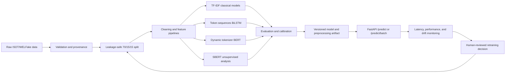

# Fake News Detection Using NLP, BiLSTM, and BERT

A modular, reproducible, production-style fake-news classification system aligned with the **Machine Learning (25SC2107E)** syllabus and its Course Outcomes **CO1–CO6**. The implementation is designed for the ISOT Fake News Dataset and WELFake dataset, with a common ingestion contract, leakage-safe preprocessing, classical baselines, unsupervised structure discovery, optional BiLSTM and BERT fine-tuning, rigorous evaluation and calibration, FastAPI serving, artifact packaging, and drift monitoring.

> **Important limitation:** This project classifies patterns associated with dataset labels. It is not an independent fact-checking system and must not be used as the sole basis for editorial, legal, medical, financial, or public-safety decisions.

## Compliance status

The repository is being implemented against the attached `MachineLearninghandout.pdf`. Every module, script, notebook, experiment, and operational artifact will be mapped to a course outcome and syllabus module in [`docs/compliance_matrix.md`](docs/compliance_matrix.md). Inline comments in the required implementation modules identify the relevant syllabus coverage; the source register provides the academic and technical references behind those comments.

| Handout area | Repository evidence |
|---|---|
| **CO1 / M1**: ML lifecycle | `src/data/`, `src/features/`, `src/models/`, `src/evaluation/`, `src/serving/`, `src/monitoring/`, lifecycle diagram, request trace, and training-serving boundary documentation |
| **CO2 / M2**: linear models | L1, L2, and ElasticNet Logistic Regression over TF-IDF; scaling rationale; coefficient and regularization analysis |
| **CO3 / M3**: tree models | Pruned Decision Tree, OOB Random Forest, XGBoost, LightGBM, Gini/permutation/SHAP importance |
| **CO4 / M4**: unsupervised learning | K-Means, elbow/silhouette, hierarchical clustering, DBSCAN, PCA, t-SNE, UMAP, Isolation Forest, feature augmentation |
| **CO5 / M5**: evaluation and selection | 70/15/15 split, stratified 5-fold CV, grid/random/Bayesian-search path, metrics, learning/validation curves, calibration, Brier score, McNemar test |
| **CO6 / M6**: ML engineering | Configuration, versioned artifacts, skew prevention, ONNX/TorchScript where supported, FastAPI, Docker, CI, MLflow, KS/PSI drift monitoring |

## Architecture and lifecycle



A single online request follows the path **HTTP validation → text normalization/tokenization → packaged feature transform → model inference → calibrated response → latency and monitoring hooks**. Batch inference uses the same preprocessing and model artifact over a bounded list of requests. The production boundary is the serialized preprocessing-plus-model artifact, which prevents a serving implementation from silently diverging from training.

## Repository map

| Path | Responsibility | Handout mapping |
|---|---|---|
| `data/` | Raw, processed, external, and reproducibility placeholders; raw data is not committed by default | CO1/M1 |
| `notebooks/` | EDA, unsupervised analysis, model comparison, deep-learning experiments, and evaluation evidence | CO1–CO5 / M1–M5 |
| `src/data/ingestion.py` | ISOT/WELFake adapters, validation, canonical schema, split manifests | CO1/M1 |
| `src/features/` | Cleaning, TF-IDF, GloVe, tokenization, SBERT, and feature contracts | CO1/M1, CO4/M4 |
| `src/models/unsupervised.py` | K-Means, hierarchical clustering, DBSCAN, PCA, t-SNE, UMAP, Isolation Forest | CO4/M4 |
| `src/models/classical.py` | Logistic, Decision Tree, Random Forest, XGBoost, LightGBM | CO2/M2, CO3/M3 |
| `src/models/lstm.py` | GloVe-initialized BiLSTM classifier | CO1/M1, CO5/M5 |
| `src/models/bert.py` | `bert-base-uncased` fine-tuning path | CO1/M1, CO5/M5 |
| `src/evaluation/metrics.py` | Metrics, cross-validation, calibration, curves, and statistical tests | CO5/M5 |
| `src/serving/app.py` | FastAPI health and prediction endpoints | CO6/M6 |
| `src/monitoring/drift.py` | KS and PSI drift checks plus monitoring reports | CO6/M6 |
| `configs/` | `default.yaml`, `models.yaml`, and `evaluation.yaml` for data, models, evaluation, serving, and monitoring | CO1/M1, CO5/M5, CO6/M6 |
| `tests/` | Unit, integration, leakage, serialization, export, and API tests | CO1–CO6 |
| `docs/sources.md` | Complete source, provenance, license, and source-to-file register | All outcomes |
| `docs/sources.yaml` | Machine-readable source metadata used by audit tooling | All outcomes |
| `docs/compliance_matrix.md` | Script/notebook/test/artifact traceability to every CO and module | All outcomes |

## Data and label policy

The ingestion layer accepts ISOT and WELFake through adapters rather than assuming one CSV schema. The ISOT source is documented through Ahmed, Traore, and Saad’s publication [1], while the WELFake record is maintained through Zenodo with DOI `10.5281/zenodo.4561253` [2]. WELFake’s Zenodo record describes the released columns and reports the dataset’s published label convention; the repository normalizes all supported inputs to its explicit internal convention of `0 = real` and `1 = fake`, recording any source-label inversion in the ingestion metadata [2].

Raw datasets, pretrained weights, and generated model artifacts are excluded from version control unless their license and repository size make inclusion appropriate. The repository records URLs, DOIs, access dates, versions, checksums, and license terms in [`docs/sources.md`](docs/sources.md). Dataset download and checksum commands will be added to the data-ingestion documentation once the executable pipeline is present.

## Reproducibility and leakage prevention

The default split is stratified **70% training, 15% validation, and 15% test** with a recorded seed and split manifest. Stratified five-fold cross-validation is used for training-set model selection. TF-IDF vocabularies, scalers, token vocabularies, dimensionality reducers, clusterers, anomaly detectors, calibration maps, and thresholds must be fitted only on their permitted training data. The final test set is held out from model-selection and calibration decisions.

Every trained artifact records its configuration, random seed, dataset identity, source checksum where available, software versions, feature schema, model family, and training timestamp. Results are reported only for experiments actually executed; optional models that cannot run because of missing hardware or dependencies are marked as unavailable rather than assigned invented scores.

## Planned commands

The executable workflow is:

```bash
python -m src.data.ingestion --dataset isot --path data/raw/isot --output data/processed
python -m src.train --train data/processed/train.csv --model logistic_l2 --output artifacts/models/logistic_l2.joblib
python -m src.evaluate --test data/processed/test.csv --artifact artifacts/models/logistic_l2.joblib
uvicorn src.serving.app:app --host 0.0.0.0 --port 8000
pytest -q
```

The foundational tranche includes this README, [`docs/sources.md`](docs/sources.md), [`docs/sources.yaml`](docs/sources.yaml), and [`requirements.txt`](requirements.txt). The classical fixture workflow has been exercised; full-dataset and deep-learning benchmark commands must be run only after the corresponding raw data and optional resources are available.

## Model and evaluation scope

The classical benchmark will compare regularized Logistic Regression, Decision Tree, Random Forest, XGBoost, and LightGBM. The deep-learning benchmark will add a GloVe-initialized BiLSTM and fine-tuned BERT when the required resources are available. Evaluation will include accuracy, precision, recall, macro and weighted F1, ROC-AUC, PR-AUC, confusion matrices, ROC/PR curves, learning curves, validation curves, Platt scaling, isotonic regression, reliability diagrams, Brier scores, and McNemar’s test. The final benchmark table will distinguish cross-validation results, validation calibration results, and the untouched test-set results.

## Serving and monitoring scope

The FastAPI service will expose `/health`, `/predict`, and `/predict/batch` with Pydantic validation, bounded payloads, model/version metadata, structured errors, and latency headers. Supported models will be exportable to ONNX and TorchScript where technically valid, with a tested native fallback for unsupported operations. Monitoring will include feature and embedding distribution checks using the Kolmogorov–Smirnov test and Population Stability Index, together with hooks for latency, throughput, delayed-label performance, data drift, concept drift, and label drift.

## Source policy

**No external source may be used or referred to without an entry in the repository source register.** Every source entry records bibliographic metadata, URL or DOI, access date, version or commit where relevant, license or usage terms, and the exact repository files or claims it supports. Restricted sources are linked with complete metadata rather than redistributed. The final CI/source-audit step will check that cited source identifiers resolve to register entries and that external URLs found in tracked documentation are either registered or explicitly classified as project links.

## Academic references

The complete, file-mapped source register is [`docs/sources.md`](docs/sources.md). Key references are [1] [2] [3] [4] [5] [6] [7] [8] [9] [10] [11] [12].

## Status

The repository began as an empty GitHub repository. The implementation is being developed phase-by-phase with reproducibility, source governance, handout traceability, and test evidence treated as acceptance criteria rather than after-the-fact documentation.

## References

[1]: https://doi.org/10.1002/spy2.9 "Ahmed, Traore, and Saad, Detecting opinion spams and fake news using text classification"
[2]: https://doi.org/10.5281/zenodo.4561253 "WELFake dataset record"
[3]: https://arxiv.org/abs/1810.04805 "Devlin et al., BERT"
[4]: https://nlp.stanford.edu/projects/glove/ "Stanford GloVe project"
[5]: https://scikit-learn.org/stable/user_guide.html "scikit-learn User Guide"
[6]: https://xgboost.readthedocs.io/en/stable/ "XGBoost documentation"
[7]: https://lightgbm.readthedocs.io/en/latest/ "LightGBM documentation"
[8]: https://huggingface.co/docs/transformers/index "Hugging Face Transformers documentation"
[9]: https://fastapi.tiangolo.com/ "FastAPI documentation"
[10]: https://onnx.ai/onnx/ "ONNX documentation"
[11]: https://mlflow.org/docs/latest/ml/tracking/ "MLflow Tracking documentation"
[12]: https://docs.scipy.org/doc/scipy/reference/stats.html "SciPy statistical functions"
