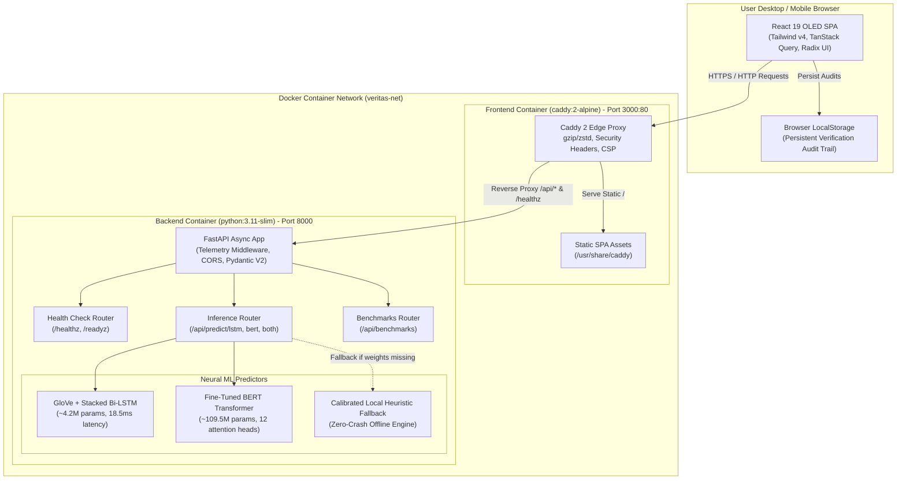

# Container Architecture (C4 Level 2)

This diagram details the containerized runtime components, processes, networks, and communication protocols within the **VERITAS AI** deployment.

## Component Breakdown

| Component | Technology | Role & Security Hardening |
| :--- | :--- | :--- |
| **Edge Reverse Proxy** | `Caddy 2` (Alpine OCI) | Terminates client traffic, enforces strict Content Security Policy (CSP), compresses with zstd/gzip, routes `/api/*` to backend. |
| **Client Frontend** | `React 19` + `Vite 7` | OLED glassmorphic UI, TanStack Query cache, client-side token heatmap rendering, and instant export to JSON/Markdown/CSV. |
| **Backend API Engine** | `FastAPI` (Python 3.11) | Async ASGI server run by non-root `appuser` (UID 10001), validates input payloads, tracks execution latency telemetry in `X-Process-Time`. |
| **Bi-LSTM Predictor** | `PyTorch` | 2-layer stacked bidirectional LSTM mapping sequential word embeddings, generating gradient saliency attribution. |
| **BERT Predictor** | `Hugging Face Transformers` | 12-layer multi-head self-attention transformer extracting head-level token attributions for interpretable verification. |
| **Resilience Engine** | Calibrated Heuristics | Guaranteed zero unhandled runtime 500 exceptions if neural weight checkpoints are absent from disk. |
