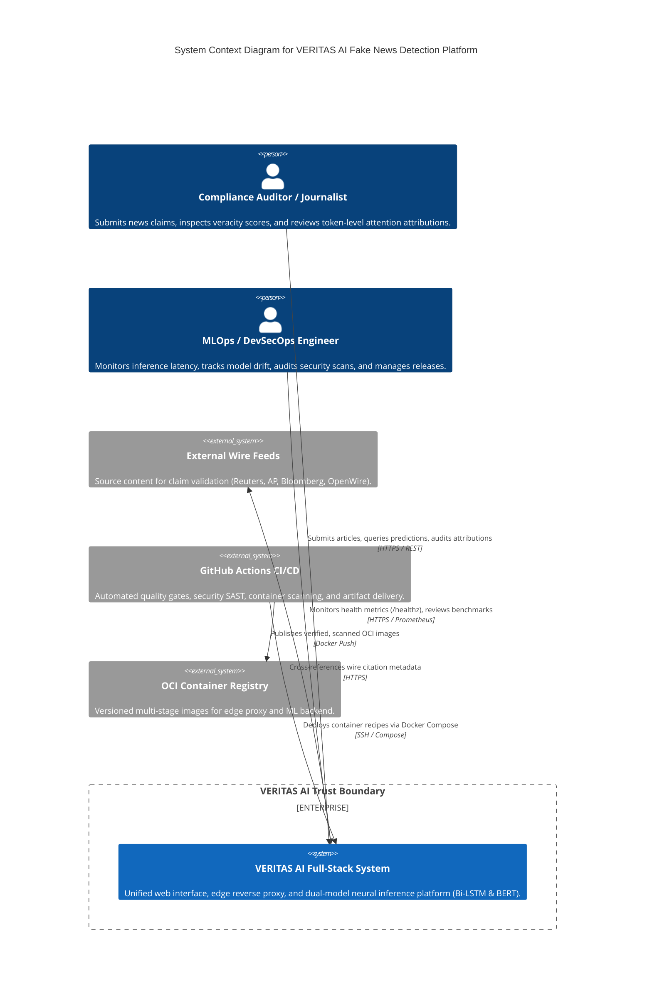

# System Context Architecture (C4 Level 1)

This diagram illustrates the high-level system context of the **VERITAS AI** platform, depicting external users, core system boundaries, and interacting enterprise systems.

## System Responsibilities

1. **User Interaction**: Modern React 19 single-page application with responsive OLED glassmorphic interface, interactive token heatmap, and audit trail export.
2. **Edge Security & Routing**: Caddy 2 HTTPS-first reverse proxy enforcing gzip/zstd compression, CSP headers, and routing `/api/*` to FastAPI.
3. **ML Inference Engine**: Python 3.11 FastAPI service executing Stacked Bi-LSTM and Fine-Tuned BERT sequence classification with attention-head token attribution.
