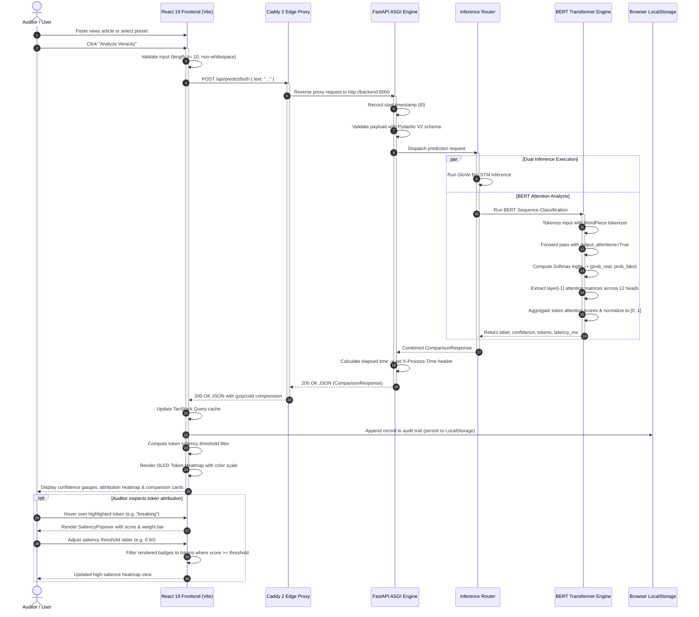

# Data Flow & Token Attribution Architecture

This document details the end-to-end data lifecycle of an inference verification request in the **VERITAS AI** platform, from raw text ingestion through transformer self-attention extraction to client-side saliency heatmap rendering.

---

## 1. End-to-End Sequence Diagram



---

## 2. Token Attribution Pipeline

The token explainability engine translates internal transformer activations into human-interpretable visual evidence:

### Step 1: Input Ingestion & Tokenization
Input text $T$ is tokenized into $N$ subword tokens:
$$\mathcal{T} = [t_1, t_2, \dots, t_N]$$
For BERT, the `BertTokenizer` prepends `[CLS]` and appends `[SEP]`.

### Step 2: Attention Head Extraction
During the model forward pass with `output_attentions=True`, attention matrices are extracted from the final transformer layer $L$:
$$\mathbf{A}^{(h)} \in \mathbb{R}^{N \times N}, \quad h \in \{1, \dots, H\}$$
where $H = 12$ is the number of multi-head attention heads in `bert-base-uncased`.

### Step 3: Attribution Aggregation
The relative importance $s_i$ of token $t_i$ to the classification output is computed by taking the attention directed from the classification token `[CLS]` (index 0) to token $i$, averaged across all $H$ heads:
$$\bar{a}_i = \frac{1}{H} \sum_{h=1}^H \mathbf{A}^{(h)}_{0, i}$$

### Step 4: Normalization & Calibration
Raw attention magnitudes are min-max normalized across all content tokens (excluding special tokens `[CLS]` and `[SEP]`):
$$w_i = \frac{\bar{a}_i - \min(\bar{a})}{\max(\bar{a}) - \min(\bar{a}) + \epsilon}$$
where $\epsilon = 10^{-8}$ prevents division by zero, guaranteeing $w_i \in [0.0, 1.0]$.

### Step 5: JSON Contract Serialization
The backend maps normalized tokens to the standardized OpenAPI `TokenAttribution` schema:
```json
{
  "id": "tok-bert-4-unprecedented",
  "token": "unprecedented",
  "weight": 0.874,
  "direction": "fake",
  "rawScore": -1.573,
  "reason": "Hyperbolic outcome promise / sensational lexical cue"
}
```

### Step 6: Client-Side Heatmap Rendering
The React frontend evaluates each token against the user-selected threshold $\tau$:
- If $w_i \ge \tau$, the token receives an OLED glassmorphic badge with background opacity mapped to $w_i$.
- Color coding corresponds to the predicted class: Emerald green (`rgba(16, 185, 129, w_i)`) for **REAL**, and Crimson red (`rgba(239, 68, 68, w_i)`) for **FAKE**.
- Radix UI popovers reveal exact numeric attribution values on pointer hover.
